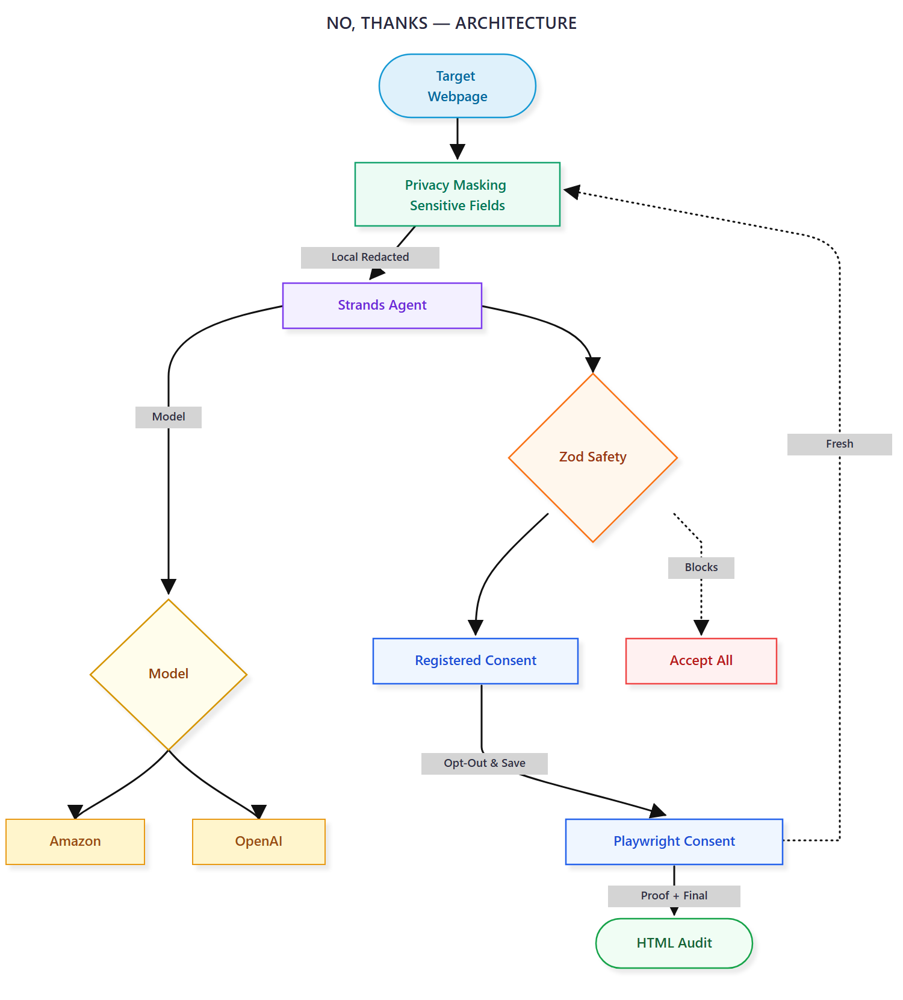
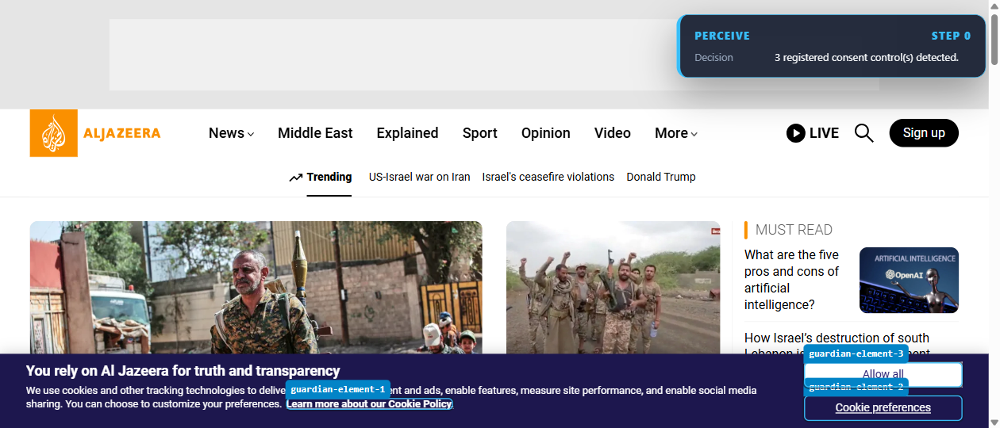
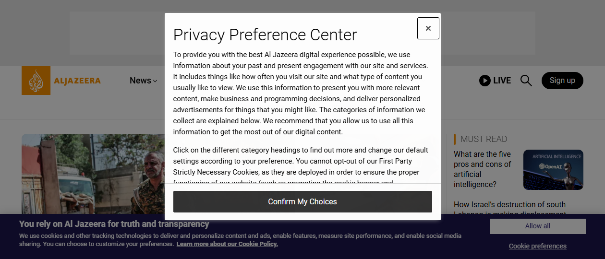

# NO, THANKS.

**Privacy without the consent maze.**

> Built for the **AWS Agents for Humans Hackathon** using **Strands Agents SDK**.

**No, Thanks** is an autonomous cookie-consent agent that recognizes deceptive consent interfaces, chooses the most privacy-preserving safe action, and verifies what actually changed. It combines visual and DOM evidence so users do not have to navigate confusing banners, nested preference centers, or preselected tracking controls manually.

[Installation & Execution Guide](execution-steps.md) · [Sample Outputs & Audit Evidence](sample-output/README.md)

---

## Why It Matters

Consent banners often turn a simple privacy choice into a test of patience: acceptance is prominent, rejection is hidden, and optional tracking is enabled by default. This design disproportionately burdens people with limited time, accessibility needs, or less technical experience.

**No, Thanks** restores a clear outcome without taking control away from the user. It prefers explicit rejection, disables only non-essential tracking, preserves necessary functionality, and stops safely whenever an interface is ambiguous.

---

## Key Features

- **Visual & Structural Perception:** Combines page screenshots with a bounded, consent-oriented DOM view.
- **Late-Banner Discovery:** Listens to DOM and frame events so delayed consent interfaces still trigger an audit.
- **Cross-Frame Coverage:** Discovers controls inside same-origin and cross-origin CMP frames, fixed action bars, and open shadow DOM.
- **Local Privacy Masking:** Redacts sensitive form fields locally before any screenshot reaches a remote model.
- **Strands Agent Orchestration:** Supports OpenAI Responses, Amazon Bedrock, and deterministic offline reasoning through a unified agent path.
- **Default-Deny Execution:** Enforces strict Zod policies; models can interact only with registered consent controls while "Accept All" remains blocked.
- **Fresh-State Verification:** Re-perceives the page before actions and after decisions, invalidating stale model responses.
- **Auditable Evidence:** Produces human-readable reports, structured JSON logs, screenshots, and execution recordings.

---

## Tech Stack

- **Agent Engine & SDK:** Strands Agents SDK
- **Multimodal Models:** OpenAI Responses API / Amazon Bedrock (Nova / Claude)
- **Browser Automation:** Playwright (Chromium)
- **Safety Policy & Validation:** Zod Schema Enforcement
- **Privacy Masking & Image Processing:** Sharp / Canvas (Local JPEG Redaction)
- **Language & Runtime:** Node.js / TypeScript

---

## Architecture



> **The Agent Loop:** Perceive $\rightarrow$ Mask $\rightarrow$ Reason $\rightarrow$ Validate $\rightarrow$ Act $\rightarrow$ Verify

The target page is perceived through DOM and pixel evidence. Sensitive fields are masked locally, then the Strands agent selects a privacy-preserving step through the configured model. A strict Zod-backed policy gate validates every decision before a registered Playwright tool can act. Fresh perception closes the loop, and the final audit report records what was observed, changed, and verified.

The runtime uses OpenAI through the Strands Agents SDK via a decoupled Provider Factory pattern. An Amazon Bedrock adapter is also integrated for AWS-hosted multimodal reasoning, alongside a deterministic mock provider for offline development.

---

## Product Architecture & Everyday Consumer Roadmap

### Why Playwright for the Hackathon Prototype?

For this hackathon implementation, **No Thanks** uses a Playwright browser driver. This choice was made intentionally to:

- **Expose Full Agent Decision-Making:** Enable visible Inspector mode so judges and developers can observe real-time visual grounding, DOM interaction, and multi-frame layout analysis.
- **Isolate the Engine:** Prove that the `@strands-agents/sdk` reasoning loop can independently navigate complex shadow DOMs, cross-origin iframes, and dark patterns across real web environments without browser-specific extension constraints.

---

### Consumer Roadmap: How Everyday Users Will Use "No Thanks"

Regular users will not launch terminal scripts or separate Playwright sessions. The core Strands engine is architected to decouple reasoning from browser execution, enabling a seamless production deployment:

```text
              ┌─────────────────────────────────────────┐
              │       Core Strands Agent Engine         │
              │ (Visual Grounding & Privacy Decision)   │
              └────────────────────┬────────────────────┘
                                   │
            ┌──────────────────────┴──────────────────────┐
            ▼                                             ▼
┌───────────────────────────────┐    ┌───────────────────────────────┐
│ Chrome / Firefox Extension    │    │ Background Desktop Service    │
│ Runs silently in user's main  │ OR │ Runs in System Tray (Tauri/   │
│ browser; auto-declines cookie │    │ Electron); manages session    │
│ banners on page load.         │    │ privacy across all browsers.  │
└───────────────────────────────┘    └───────────────────────────────┘
```

1. **Phase 1: Chrome / Firefox WebExtension (Primary UX)**
   - **Frictionless Experience:** Users install a browser extension and browse normally in Chrome, Brave, or Edge.
   - **Zero-Click Rejection:** When a site loads a cookie banner or dark pattern, the extension background script detects the overlay and triggers the local Strands agent to execute the rejection path automatically in milliseconds.
2. **Phase 2: System-Tray Desktop Utility**
   - **Cross-Browser Privacy Guard:** Runs locally in the background (via Tauri/Electron) to protect privacy preferences across multiple installed browsers simultaneously without data leaving the machine.

---

## Demos & Visual Proof

### Demo 1 — Headed Debug Mode

**Al Jazeera: Bounding boxes, visual reasoning, privacy controls, and live verification.**

[](https://youtu.be/qIbm-Ks4NIQ)

The Inspector overlay makes each step visible. Registered controls receive internal IDs, optional cookie categories are disabled, and the final capture confirms banner removal.

### Demo 2 — Headless Production Run

**Fast background execution with no visual overlay or presentation delay.**

[](https://youtu.be/rx1-FUpSYHI)

Headless mode optimizes for unattended execution using the same safety and verification pipeline. The action path completes in roughly five seconds once a consent surface is ready. All test cases are indexed in [`sample-output/`](sample-output/README.md).

---

## Safety & Trust Boundaries

**No, Thanks** never provides a model with raw selectors, arbitrary JavaScript, screen coordinates, cookies, passwords, or form values. Models can reference only short-lived internal consent IDs generated from current perception.

The local safety policy strictly blocks:

- "Accept All" / "Allow All" selections
- Destructive account actions, purchases, and authentication steps
- Unsafe cross-origin link navigation
- Unregistered toggle changes

An uncertain decision triggers a safe stop rather than falling back to acceptance. Verification is evidence-based; runs are marked as verified only when fresh post-action DOM state confirms the target banner has been dismissed.

---

## Human Impact

**No, Thanks** reduces the cognitive and accessibility burden of deceptive consent design while preserving user autonomy. It turns a complex visual maze into a transparent sequence whose inputs, decisions, safety checks, and proof can be reviewed afterward.

---

## Setup & Documentation

For step-by-step installation guides, environment variable setups, CLI execution flags, and testing instructions, refer to the dedicated guide:

📖 **[Read execution-steps.md](execution-steps.md)**

---

## License

[MIT](LICENSE)
